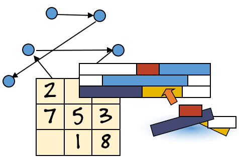

Bonjour, cher lecteur !

Il paraît que tu souhaites apprendre la programmation par contraintes. :)

> **TL;DR :** Cet article présente la programmation par contraintes et propose
> une liste de ressources pour l'apprendre. Passe directement aux
> [ressources](https://github.com/rosasbehoundja/learning-constraint-programming)
> si tu veux aller à l'essentiel.

## Qu'est-ce qu'un problème combinatoire ?

Un problème combinatoire consiste à sélectionner, ordonner, regrouper ou
affecter des objets appartenant à un ensemble fini, tout en respectant un
ensemble de conditions ou de contraintes. [ScienceDirect](https://www.sciencedirect.com/topics/computer-science/combinatorial-problem)

Une solution candidate est une combinaison des éléments du problème qui peut
être examinée au cours de la recherche. Une solution valide est une solution
candidate qui satisfait toutes les conditions imposées.

Pour une introduction plus détaillée, consulte
[Introduction: Combinatorial Problems and Search, page 4, par Holger H. Hoos et Thomas Stützle](https://www.cs.ubc.ca/~hoos/SLS-Book/Slides/Chapter-1/ch1-slides-2p.pdf).

Les problèmes combinatoires apparaissent dans de nombreux domaines de
l'informatique et dans de nombreuses applications concrètes, notamment :

- la recherche du circuit le plus court ou le moins coûteux, comme dans le problème du voyageur de commerce (TSP) ;
- la recherche de modèles de formules propositionnelles, comme dans les problèmes de satisfaisabilité booléenne (SAT) ;
- la planification, l'ordonnancement et la création d'emplois du temps ;
- le routage de paquets de données sur Internet ;
- la prédiction de structures protéiques.

## Qu'est-ce que l'optimisation combinatoire ?

L'optimisation combinatoire consiste à rechercher la meilleure solution parmi
un ensemble fini, et souvent extrêmement vaste, de possibilités.

Une solution doit d'abord satisfaire les contraintes du problème. Parmi toutes
les solutions réalisables, on cherche ensuite celle qui minimise ou maximise une
fonction objectif, par exemple un coût, une distance, une durée ou un profit.

Ce domaine se situe à l'intersection des mathématiques, de l'informatique et de
la recherche opérationnelle. Son objectif est non seulement de concevoir des
algorithmes efficaces, mais aussi d'évaluer ou de certifier la qualité des
solutions qu'ils produisent.

Pour aller plus loin, consulte les ressources de
[l'EPFL](https://www.epfl.ch/labs/disopt/teaching/page-31586-en-html/page-10545-en-html/)
et de [DeepAI](https://deepai.org/machine-learning-glossary-and-terms/combinatorial-optimization).

L'optimisation combinatoire intervient notamment dans :

- la logistique et l'optimisation des chaînes d'approvisionnement ;
- la conception de réseaux aériens ;
- l'affectation de taxis ou de véhicules de transport ;
- la planification des livraisons de colis ;
- l'affectation optimale de tâches à des personnes ;
- la conception de réseaux de distribution d'eau ;
- certains problèmes de sciences de la Terre, comme l'optimisation du débit des réservoirs.

## Qu'est-ce que la programmation par contraintes ? Enfin !

La programmation par contraintes, ou CP pour *Constraint Programming*, est un
paradigme permettant de résoudre des problèmes combinatoires en décrivant :

- les variables du problème ;
- les valeurs possibles de ces variables, appelées domaines ;
- les contraintes que les solutions valides doivent satisfaire ;
- éventuellement, un objectif à minimiser ou à maximiser.

Au lieu de décrire une suite d'instructions permettant de construire une
solution, on décrit les propriétés que celle-ci doit posséder. Un solveur de
contraintes utilise ensuite des techniques telles que la propagation de
contraintes et la recherche pour trouver une ou plusieurs solutions.

La programmation par contraintes peut donc servir aussi bien à résoudre des
problèmes de satisfaction de contraintes que des problèmes d'optimisation.

Consulte :
  * [IBMDecisionOptimization](https://ibmdecisionoptimization.github.io/docplex-doc/cp.html)
  * [Gurobi](https://www.gurobi.com/resources/faq/constraint-programming)
  * [SINTEF](https://www.sintef.no/en/digital/departments/mathematics-and-cybernetics/optimization/expertize/combinatorial-optimisation/).

## Quand utiliser la programmation par contraintes — et quand l'éviter

### Utiliser la CP lorsque le problème se décrit plus naturellement par ses conditions

Un bon indice que la CP est adaptée est qu'il est plus naturel de décrire les
conditions que doit satisfaire une solution valide que d'écrire les étapes
nécessaires pour la construire.

Prenons un problème d'ordonnancement : chaque tâche doit commencer après celles
dont elle dépend, deux tâches utilisant la même machine ne doivent pas se
chevaucher, chaque employé a une disponibilité limitée et certaines opérations
doivent avoir lieu dans une fenêtre de temps donnée. Ces règles se traduisent
directement en contraintes. Le modèle indique *ce qui* doit être respecté,
tandis que le solveur détermine *comment* explorer les affectations possibles.

La CP est donc particulièrement intéressante lorsque :

- les décisions sont discrètes et reliées par des règles logiques riches ;
- le problème comporte des contraintes d'ordonnancement, de routage, d'affectation, de placement ou de configuration ;
- des contraintes globales comme `allDifferent`, `cumulative`, `noOverlap` ou `circuit` permettent d'exprimer une structure importante ;
- il est important de trouver une solution réalisable, de prouver qu'il n'en existe aucune ou de prouver l'optimalité ;
- les exigences changent souvent et le modèle doit rester facile à faire évoluer.

### Rester prudent face aux très grandes instances

La taille d'une instance ne suffit pas, à elle seule, à déterminer si la CP sera
efficace. Un grand modèle doté de contraintes fortes peut être résolu rapidement,
car la propagation élimine de nombreuses valeurs impossibles avant la recherche.
À l'inverse, un modèle plus petit avec des contraintes faibles, de grands
domaines ou beaucoup de symétries peut produire un arbre de recherche immense.

Une approche CP générique peut rencontrer des difficultés face à des millions de
variables, une propagation faible, des interactions très denses ou des
exigences strictes de temps réel. Si le problème est principalement linéaire et
continu, la programmation linéaire ou linéaire en nombres entiers peut être plus
adaptée. Un problème possédant une structure particulière peut aussi mieux se
prêter aux algorithmes de flot, aux solveurs SAT ou CP-SAT, à la programmation
dynamique ou à une heuristique spécialisée.

Pour les instances à grande échelle, la réponse pratique n'est souvent pas
d'abandonner la CP, mais de la combiner avec la décomposition, la rupture de
symétries, des contraintes redondantes, la recherche à grand voisinage, la
recherche locale ou la programmation mathématique. La bonne question n'est donc
pas seulement « Quelle est la taille de l'instance ? », mais aussi « Quelle part
de sa structure le solveur peut-il exploiter ? »

### L'apprentissage peut guider la recherche

L'une des orientations récentes les plus intéressantes consiste à associer
l'apprentissage automatique à la recherche combinatoire. Pendant la recherche,
un solveur choisit successivement une variable, une valeur, une branche ou un
voisinage à explorer. Ces décisions reposent traditionnellement sur des
heuristiques génériques ou conçues manuellement. Lorsque de nombreuses instances
similaires sont disponibles, un modèle peut plutôt apprendre quelles décisions
conduisent le plus souvent à de bonnes solutions.

L'idée centrale n'est pas nécessairement de remplacer le solveur. La composante
apprise oriente la recherche vers les régions prometteuses, tandis que le solveur
de contraintes continue à garantir la faisabilité, à calculer des bornes et,
lorsque la recherche est menée à son terme, à fournir des garanties exactes.

Par exemple, [SeaPearl](https://arxiv.org/abs/2102.09193) explore l'apprentissage
par renforcement pour prendre les décisions de branchement au sein d'un solveur
CP. D'autres travaux emploient des réseaux de neurones sur graphes comme
[heuristiques globales pour la satisfaction de contraintes](https://www.ijcai.org/proceedings/2023/476),
tandis que des recherches plus récentes utilisent l'apprentissage par
renforcement pour
[réduire les arbres de recherche de la CP sur des problèmes d'ordonnancement](https://doi.org/10.1016/j.cie.2025.111413).

Cette approche hybride est particulièrement prometteuse pour les familles de
problèmes récurrents, dont les anciennes instances peuvent servir
d'entraînement. Elle conserve toutefois certaines difficultés : l'entraînement
peut être coûteux, les politiques apprises peuvent mal se généraliser à des
instances différentes et l'inférence ajoute un surcoût. L'apprentissage reste donc
un guide et non une garantie ; la recherche et la propagation demeurent
essentielles.

Merci pour ta lecture !
