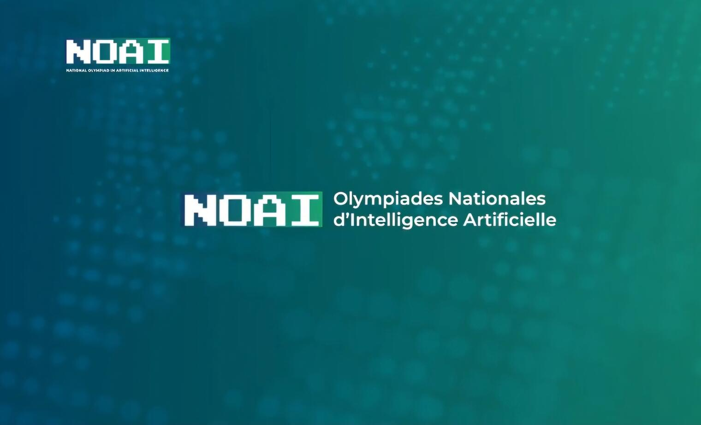
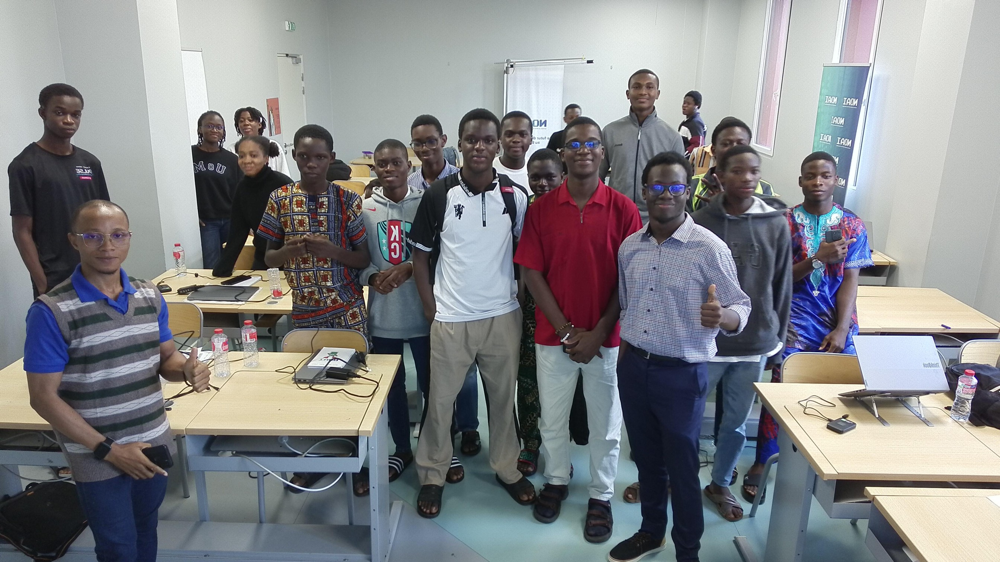
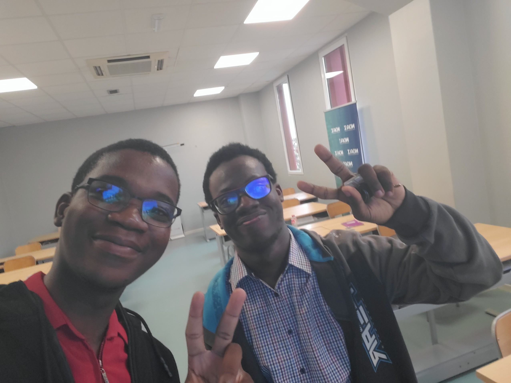
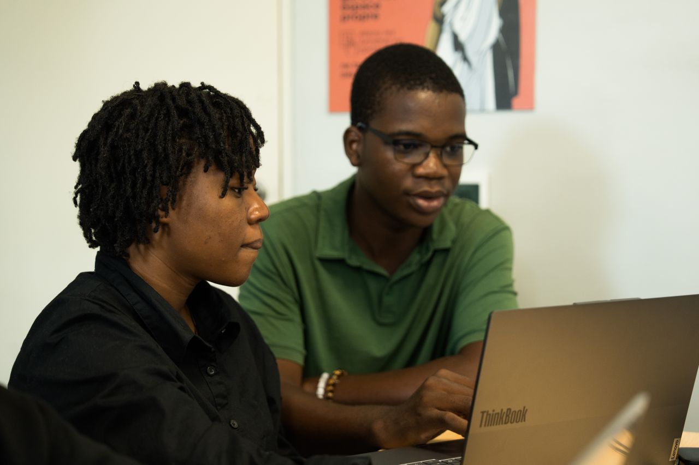
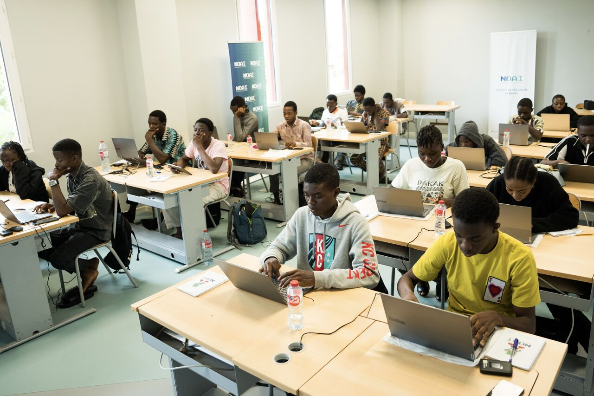

<!--lang:fr-->

[NOAI Benin](https://www.gouv.bj/article/3565/le-benin-lance-olympiades-nationales-intelligence-arti%EF%AC%81cielle-selectionner-talents-representeront-pays-kazakhstan/)

Le **National Olympiad in AI (NOAI)** est une compétition académique nationale destinée aux lycéens pour tester et développer leurs compétences en intelligence artificielle, notamment en programmation Python et en apprentissage automatique. Elle vise à repérer les jeunes talents scientifiques et à démocratiser la maîtrise des technologies de l'IA dès le secondaire. Enfin, cette olympiade sert de phase de sélection officielle pour composer l'équipe qui représentera le pays lors de la compétition mondiale (IOAI). 
Source : https://ioai-official.org/noai/

En 2025, mon pays le Bénin 🇧🇯 a participé à la deuxième édition des Olympiades Internationales de l'Intelligence Artificielle ([OIAI](https://semecity.bj/ioai-2025-les-jeunes-talents-beninois-prets-a-representer-le-pays-en-chine/))à Beijing en Chine. Heureux de cette expérience et armés de la volonté d'"**investir dans les talents qui construiront l'avenir numérique de demain**", il s'est donné pour objectif de repartir cette année à Astana au Kazakhstan, pour la troisième édition.
Dans le cadre de cette préparation, une [**NOAI**](https://www.gouv.bj/article/3565/) s'est tenue afin d'identifier parmi 150 talents sélectionnés de par le pays, les 20 capables de suivre et un bootcamp intensif au terme duquel huit jeunes constitueront l'équipe nationale qui représentera le Bénin.

C'est lors de la tenue de ce bootcamp, que j'ai pu servir en tant que mentor en **Machine Learning Appliqué**.
Mon rôle consistait à expliquer les challenges / épreuves techniques de la journée, de répondre aux questions et de guider chacun des jeunes dans ses travaux.

J'ai été assez surpris du niveau de quelques uns et encore plus amusé de voir le doute, la peur, la curiosité et tout le cocktail d'émotions qui planait dans la salle.

Chacun d'entre eux possède un potentiel. Certains en sont conscient et commencent déjà à l'exploiter, d'autres le savent mais n'osent pas encore et le reste le découvrira en chemin. 
Une chose est sûre, _**faber est suae quisque fortunae**_ (chacun est l'artisan de sa propre fortune).

Je suis très content de les avoir rencontrés et d'avoir contribué à leur formation.

Rosas.

## Galerie Photo:

  
  
  
  

<!--lang:en-->

[NOAI Benin](https://www.gouv.bj/article/3565/le-benin-lance-olympiades-nationales-intelligence-arti%EF%AC%81cielle-selectionner-talents-representeront-pays-kazakhstan/)

The **National Olympiad in AI (NOAI)** is a national academic competition for high school students to test and develop their skills in artificial intelligence, particularly in Python programming and machine learning. It aims to spot young scientific talent and to democratize mastery of AI technologies as early as high school. Finally, this olympiad serves as the official selection phase to build the team that will represent the country at the global competition (IOAI).
Source: https://ioai-official.org/noai/

In 2025, my country Benin 🇧🇯 took part in the second edition of the International Olympiad in Artificial Intelligence ([IOAI](https://semecity.bj/ioai-2025-les-jeunes-talents-beninois-prets-a-representer-le-pays-en-chine/)) in Beijing, China. Happy with that experience and driven by the will to "**invest in the talents who will build tomorrow's digital future**," the goal this year is to head back to Astana, Kazakhstan, for the third edition.
As part of this preparation, a [**NOAI**](https://www.gouv.bj/article/3565/) was held to identify, among 150 talents selected from across the country, the 20 capable of taking part in an intensive bootcamp, at the end of which eight young people will make up the national team representing Benin.

It was during this bootcamp that I got to serve as a mentor in **Applied Machine Learning**.
My role was to explain the day's technical challenges, answer questions, and guide each of the young participants through their work.

I was quite surprised by the level of some of them, and even more amused to see the doubt, the fear, the curiosity, and the whole cocktail of emotions hovering in the room.

Each one of them has potential. Some are aware of it and already starting to tap into it, others know it but don't dare yet, and the rest will discover it along the way.
One thing is certain, _**faber est suae quisque fortunae**_ (each person is the architect of their own fortune).

I'm very happy to have met them and to have contributed to their training.

Rosas.

## Photo Gallery:

  
  
  
  

